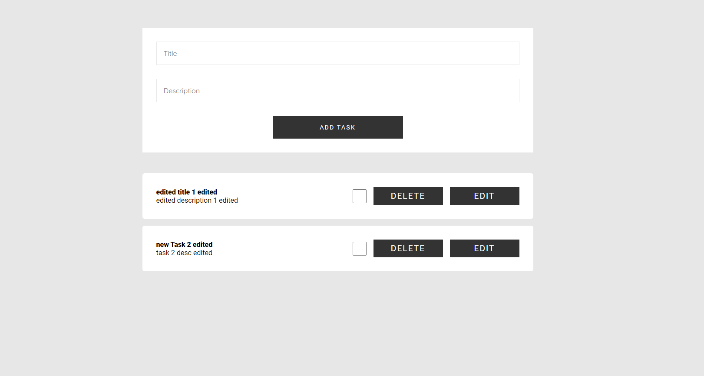

# Todo Crud Mern App

## Tech Stack

- Library :- ReactJS
- IDE :- vscode, neovim
- Backend: MongoDB, Express,
- JWT Token:jsonwebtoken
- Password Hasing: Bcrypt
- CORS: for cors policy & access
- CSS :- Vanilla CSS

### View the live Site here <ins>_[Live Site](https://todo-app-backend-6packs.vercel.app)_</ins>

## How UI looks like

### Home Page

### Login Page

### SignUp Page

